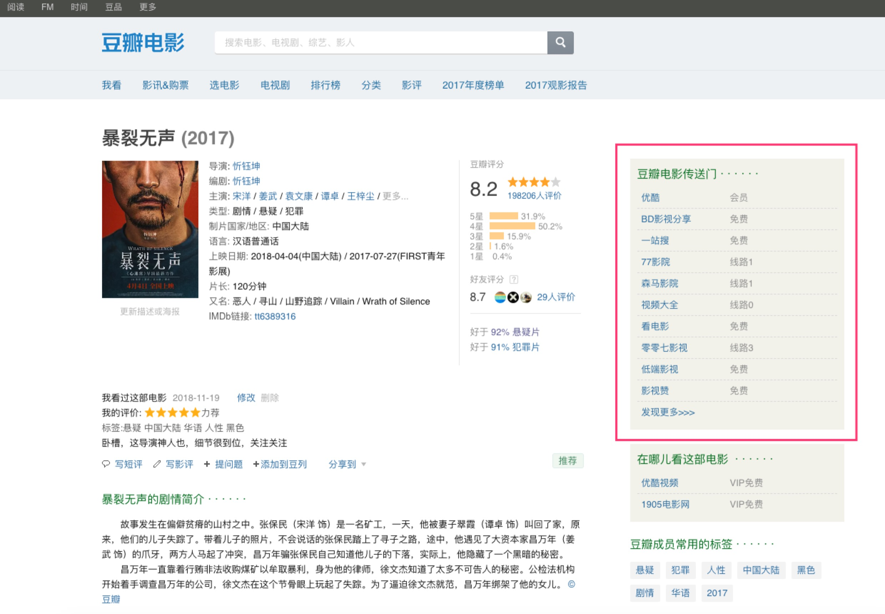

# 豆瓣电影传送门

我是一名豆瓣爱好者，常常在豆瓣APP上面标记想看的电影，然后在有空的时候再去找资源看。豆瓣最近新增了”在哪儿看这部电影“版块，但是仅仅收录了比较常见的几家视频网站，比如优酷、腾讯视频等，这些网站往往需要购买VIP才能观看，为了节约花在找资源上的时间，我写了这个”豆瓣电影传送门“Chrome插件，妈妈再也不会担心我找不到电影资源了~🍻🍻🍻

# 使用效果

如图，在豆瓣电影页面的右边栏增加”豆瓣电影传送门“模块：

# TODO列表
- 近日（2019年03月22日）发现本插件依赖的网站[neets](https://neets.cc/)在搜索结果里不再展示小网站（可能因为版权原因），严重影响了该插件的想要达到的效果。所以需要自己写搜索API来支持该插件。

# 如何使用

提供两种下载方式。

方式一，Chrome官方商店：

需要翻墙，直接前往 [Chrome商店](https://chrome.google.com/webstore/detail/豆瓣电影传送门/pkidecliagangmpphpelecaoogfbnihi ) 下载；

方式二，手动安装：

1. 点击[download文件夹](https://github.com/Neulana/douban-movie-extension/tree/master/download)下载最新版本到本地；
2. 打开Chrome，在地址栏输入chrome://extensions/，回车；
3. 打开右上角的”开发者模式“开关；
4. 将已下载的crx文件拖入Chrome扩展程序窗口；
5. 打开任意电影的[豆瓣主页](https://movie.douban.com/subject/26647117/)，右边就会出现”豆瓣电影传送门“版块
6. 你就可以愉快的看电影了🎉🎉🎉

**说明**：有版本更新时，可在浏览器地址栏右侧找到本插件的图标，鼠标右键选择”从Chrome中移除...“，然后，再重复以上6个步骤即可，请关注本repo~

# 感谢

- 灵感来自 [Ovilia](https://github.com/Ovilia/readfree-chrome-extension) ；
- 感谢 [zhaopengme](https://github.com/zhaopengme) 帮忙发布到Chrome商店。

# 反馈

如果使用过程中发现问题，请提 [issue](https://github.com/Neulana/douban-movie-extension/issues) 

欢迎 **fork & star** 

1. **Windows电脑上手动安装报错** 

已解决，请参考：https://github.com/Neulana/douban-movie-extension/issues/1

# 更新日志

## v1.2

- 剔除AcFun和哔哩哔哩网站来源，因为这些网站常有电影剪辑视频，而非正片，这不是我想要的；
- 列表默认展示的来源条目数量增加至15条。

# 免责声明
该插件仅限个人学习使用，严禁用于商业用途，否则后果自负；视频来自第三方网站，与我本人无关。
